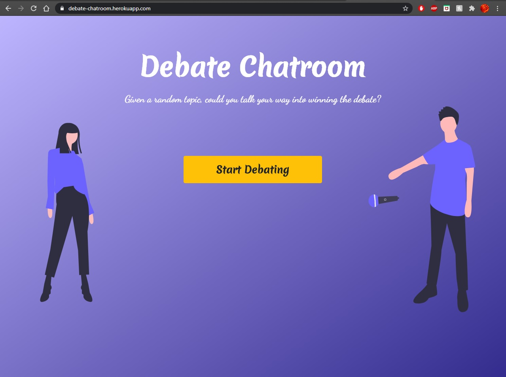
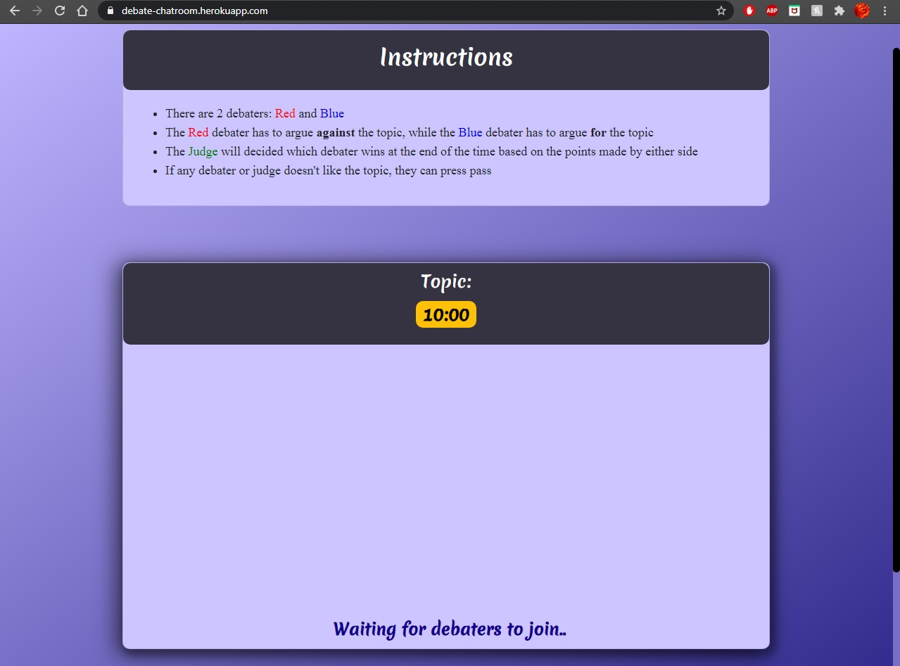
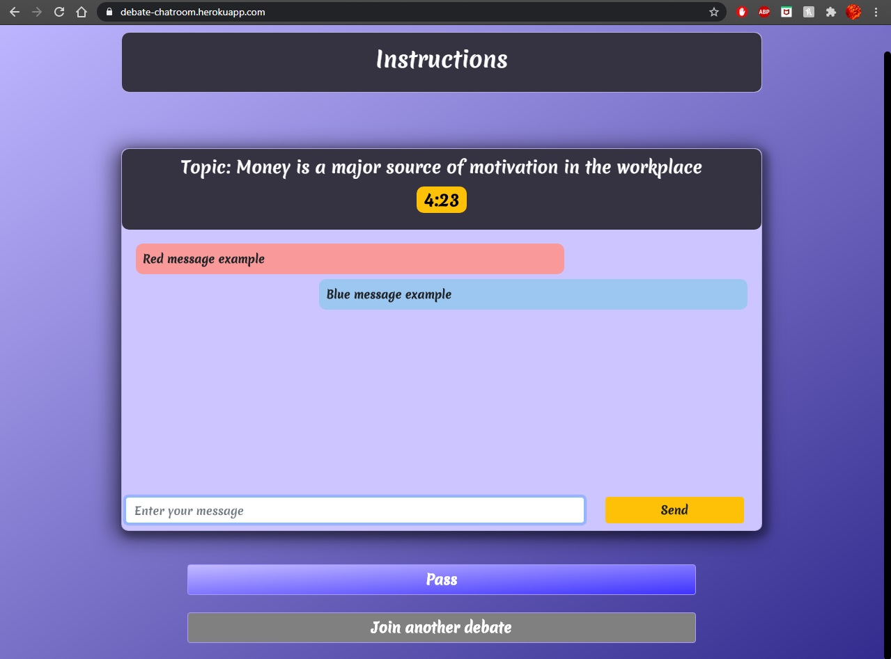
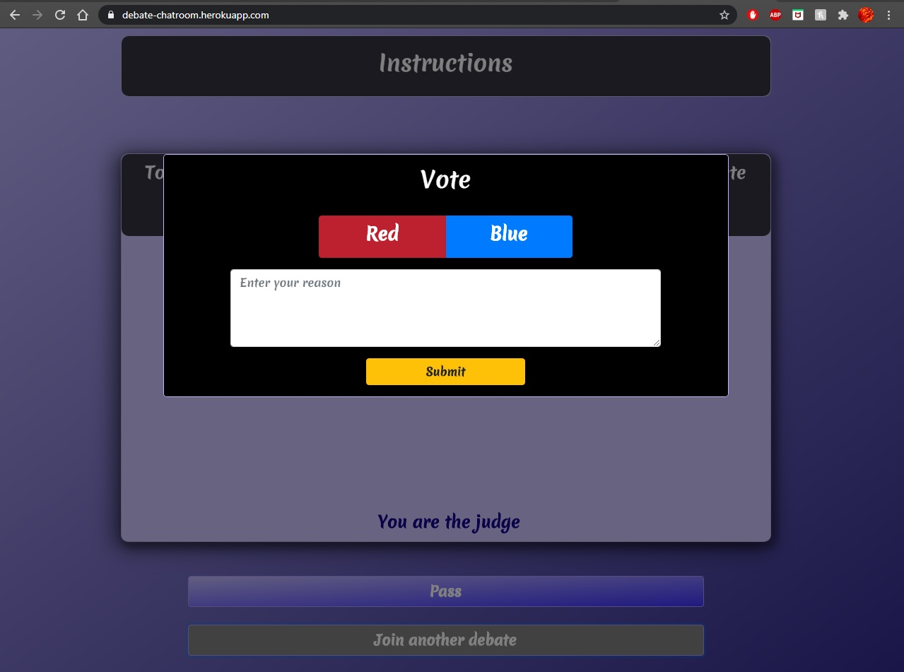

# Debate-Chatroom
This is a real-time chat website where a random topic is chosen, each 3 users are put in a room and are given 10 minutes to discuss/debate that topic.
The red side has to argue against the topic, the blue side has to argue for the topic, while the judge has to pick a winner based on the points made at the end of the time. 

Live Version: https://debate-chatroom.herokuapp.com/  
<h3>Screenshots</h3>
	
	
  
	
